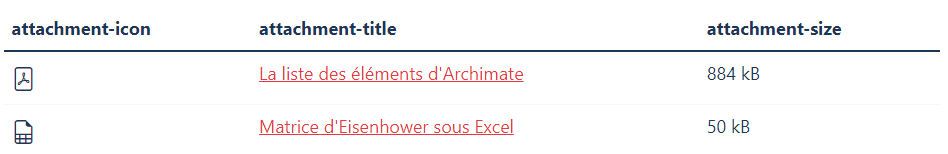
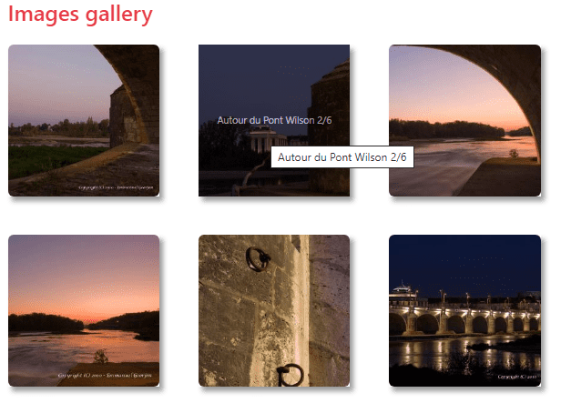
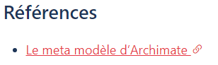
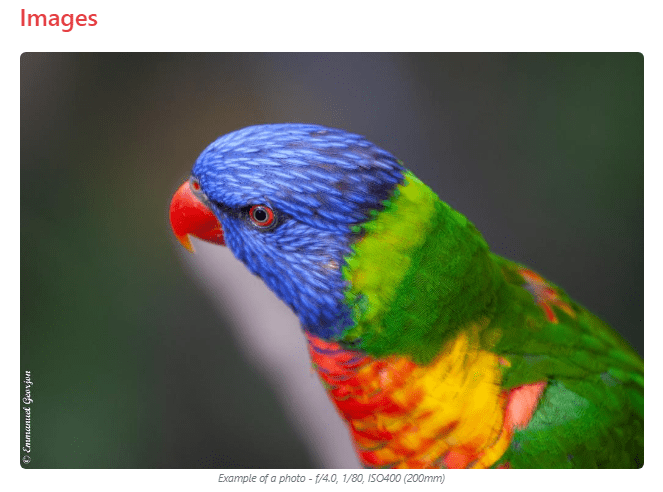

# GoYat

**Goyat** is a theme for the Hugo static site generator. This my second theme for this tool, built for my own blog.

Goyat is for huGO Yet Another Theme.

> This version is not yet finalized: Improvements are planned to stabilize it, and make it easier to use.

You can find a live demo of the theme [here](https://www.emmanuelgeorjon.com). This theme is intended for personal website and blog.

## Table of Contents

- [GoYat](#goyat)
  - [Table of Contents](#table-of-contents)
  - [Features](#features)
  - [Tools and libraries](#tools-and-libraries)
  - [Installation](#installation)
    - [Option 1: Git clone](#option-1-git-clone)
    - [Option 2: Git submodule (recommended)](#option-2-git-submodule-recommended)
    - [Option 3: Download ZIP and manual install](#option-3-download-zip-and-manual-install)
    - [Once the theme is deployed](#once-the-theme-is-deployed)
  - [Usage](#usage)
  - [Basic configuration](#basic-configuration)
    - [Tests, production, and debug](#tests-production-and-debug)
    - [Language](#language)
    - [Date format](#date-format)
    - [Pagination](#pagination)
    - [Site title / brand](#site-title--brand)
  - [Shortcodes and markups](#shortcodes-and-markups)
    - [Attachments](#attachments)
    - [imggallery](#imggallery)
    - [Blockquotes](#blockquotes)
    - [Markups](#markups)
  - [URL configuration](#url-configuration)
  - [Navigation](#navigation)
  - [Search configuration](#search-configuration)
  - [SEO](#seo)
  - [RSS, Manifest and sitemap](#rss-manifest-and-sitemap)
    - [RSS configuration](#rss-configuration)
    - [File site.manifest](#file-sitemanifest)
    - [Sitemap](#sitemap)
  - [Favicons](#favicons)
  - [Content configuration](#content-configuration)
    - [Taxonomies, and authors](#taxonomies-and-authors)
    - [Widget areas](#widget-areas)
    - [Post format in the lists](#post-format-in-the-lists)
    - [Columns](#columns)
    - [Meta information](#meta-information)
  - [Avanced configuration](#avanced-configuration)
  - [Configuration of the social media](#configuration-of-the-social-media)
    - [SEO features](#seo-features)
  - [Advanced configuration](#advanced-configuration)
    - [Manifest file](#manifest-file)
    - [Styles](#styles)

## Features

* Responsive design,
* No sidebar,
* Customizable,
* Widget based,
* Taxonomies: Tags, and series,
* Search features,
* Contact form (by Netlify),
* Piwik Pro integration,
* Google WebMaster tool integration,
* SEO features

## Tools and libraries

The theme is based on
* [BootStrap 5.1.3](https://getbootstrap.com/docs/5.0/getting-started/introduction/)
* [BootStrap Icons 1.9.0](https://icons.getbootstrap.com/)
* [Simple Lightbox 2.10.1](https://simplelightbox.com/)
* [FuseJS 6.6.2](https://fusejs.io/)

## Installation

**Goyat** is a Hugo theme. So, before installing the theme, you need to 

* Install [Hugo](https://gohugo.io), 
* and create a new site ([procedure](https://gohugo.io/getting-started/quick-start/#step-2-create-a-new-site)).

Then **Goyat** can be deployed as many other themes, with 3 possible ways:

1. Git clone
2. Git submodule
3. Download ZIP and manual install

### Option 1: Git clone

From the root directory of your site, 
```bash
git clone https://github.com/egeorjon/Goyat themes/Goyat
```
This method could generate some issues with some hosting platforms, like Netlify.

### Option 2: Git submodule (recommended)

From the root directory of your site,
```bash
git submodule add https://github.com/egeorjon/Goyat themes/Goyat
```
This is the method officially supported by Netlify.

### Option 3: Download ZIP and manual install

[Download the ZIP file](https://github.com/egeorjon/Goyat/archive/refs/heads/main.zip), and unpack it into the folder `themes/Goyat`.

### Once the theme is deployed 

Edit the file `config.toml`, and update the first line
```toml
theme = "Goyat"
```

## Usage

If you have some content, just start Hugo built-in server to see your site!

```bash
hugo server -D
```

if not, you can get the content from `examplesite`
```bash
cd my-site
cp themes/Goyat/examplesite content
hugo server -D
```

Then, to see the result, use the following url [`localhost:1313`](http://localhost:1313) in your favorite browser, 

## Basic configuration

```toml
theme                  = "Goyat"
title                  = "< title of the blog >"
baseURL                = ""       # baseURL set during builds
DefaultContentLanguage = "fr"     # Short language string fr, en,de,es
languageCode           = "fr-FR"  # Full language string fr-FR, en-US, de-DE, ...
Paginate               = 8        # Number of posts per page in the lists of posts
timeout                = 100000   # For the Hugo Engine

[params]
  debugMode            = true # default false. For development environment only. Allow the loading of scripts like Piwik, allow cache, and indexation.
  formatdate           = ":date_medium"         # format of the date you want to use
  brandlogo            = "< path to an image >"   # Logo of the site (root path)
  brandtitle           = "< title of the blog >"   # Title of the site

[Permalinks]
  posts = "/:section/:filename/"
```

### Tests, production, and debug

By default, the theme runs in test mode. For moving to the production mode, you have to set the environment variable `HUGO_ENV`
```bash
export HUGO_ENV=production
```

if you are not using bash (and/or if you are in a Microsoft Windows environment
```cmd
SET HUGO_ENV=production
```

In the Production environment,

* Google verification code is enabled,
* ROBOTS directive are set to INDEX, FOLLOW,
* Piwik is enabled (if the code and url are set, see below)

Even in development / test mode, you can "simulate" the production mode using the `debugMode` parameter. 
```toml
[params]
  debugMode = true
```

### Language

Available translations are in the `/i18n` directory of the theme. Today only english, and frenh are available.
You can configure the language modifying the following key, in the site configuration file (usually `config.toml`).

```toml
DefaultContentLanguage = "fr"
languageCode           = "fr-fr"
```

### Date format

By default, the date format is `dd-mmm-yyyy` everywhere (like 17-Apr-2022). You can configure this format, by using the following in the configuration file:
```toml
[params]
  formatdate = "<date layout>"
```

The `date layout` string can be either:

* Go’s Layout String: The full documentation for the date formats is [HERE](https://golang.org/pkg/time/#pkg-constants "Package time"), or [HERE](https://golang.org/src/time/format.go?h=date "Source file src/time/format.go")
* A custom Hugo layout identifier. See the [Hugo's documentation](https://gohugo.io/functions/dateformat/#datetime-formatting-layouts "Date/time formatting layouts") (requires the Hugo versions 0.87.0 and above)

Examples:
```toml
[params]
  formatdate = "Jan 2, 2006"
  formatdate = ":date_medium"
```
will display Apr 19, 2022.

### Pagination

You can define the number of posts listed in each page of the lists. In the configuration file `config.toml`

```toml
paginate = "<the number of posts>"
```

### Site title / brand

The navigation bar includes the main menu, and the title of the site/blog (the brand). You can fully customize the brand. In the configuration file of the site:

```toml
title = "title of the blog"
[params]
  brandlogo   = "<the path of the image related to the /static folder>"
  brandtitle  = "<the title of the site>"
```

Examples:

1. Example 1: Display both logo

```toml
[params]
   brandlogo = "img/logo.png"   # The file must be put in the folder /static/img.
```

2. Example 2: Display the blog's title 

```toml
[params]
   brandtitle = "John Doe"
```

3. Example 3: Nothing specify

```toml
theme = "Goyat"
title = "title of the blog"
[params]
#    ...
#    brandlogo is not specified, nor brandtitle
#    ...
```
In this case, the theme will display the title of the blog as a brand title.

## Shortcodes and markups

The theme provides two shortcodes 

| Shortcodes   | Description    |
|--------------|----------------|
| attachments | Display the list of documents attached to the current post |
| imggallery   | Display a photo gallery |

### Attachments

This shortcode displays a list of documents **attached** to a post.

Parameters: 

| Parameter | type   | Purpose | Mandatory | Default | Possible values |
|-----------|--------|-----------|---------|---------|-----------------|
| files     | string | **relative** path to the attachments | Yes |  | |
| fields    | string | list of fields to display | No | icon,title,size | icon,title,filename,size |

By default, the shortcode knows only the files' name. If you want to display the title of the files, you have to fill the title in the Front-Matter of the page, like in the following example:
```toml
[[resources]]
  src = "attachments/matrice_eisenhower.xlsx"
  title = "Matrice d'Eisenhower sous Excel"
[[resources]]
  src = "attachments/archimate_poster.pdf"
  title = "The Archimate elements"
``` 
With the Front Matter above, the syntax of the shortcode could be
```

``` 
and the result will be


### imggallery 

This shortcode displays a list of images with thumbnails.

Parameters: 

| Parameter | type    | Purpose | Mandatory | Default | Possible values |
|-----------|---------|-----------|---------|---------|-----------------|
| files     | string  | **relative** path to the images | Yes | | |
| size      | int     | size of the thumbnails      | No  | 250 | Any numeric value |
| caption   | boolean | Display the caption or not  | No | true | 1, true: display the caption, 0,false: don't display |
| overlay   | string  | Position of the caption     | No | bottom | top, bottom or center |


Similarly to the `attachments` shortcode, you can add a title (that will be the caption) to the thumbnails of the gallery. You can also specify if you want to display EXIF data.
The following example show the Front-Matter of a page, with 3 galleries, 2 photos in each, and the EXIF data enabled in the second one:
 ```toml
[[resources]]
title = "title 1"
src = "gallery1/photo1.jpg"

[[resources]]
title = "title 2"
src = "gallery1/photo2.jpg"

[[resources]]
title = "title 3"
src = "gallery2/photo4.jpg"

[[resources]]
title = "title 4"
src = "gallery2/photo5.jpg"

[[resources]]
title = "title 5"
src = "gallery3/photo7.jpg"

[[resources]]
title = "title 6"
src = "gallery3/photo8.jpg"

[[resources]]
title = "title 7"
src = "gallery3/photo9.jpg"
 ```

The following parameters
```

```
will give the following result:



### Blockquotes

There is no shortcode for `blockquotes`, but **Goyat** takes into account the styles you can provide below the blockquote: 

```markdown
> Lorem ipsum dolor sit amet, consectetur adipiscing elit, sed do eiusmod tempor incididunt ut labore et dolore magna aliqua.

> Lorem ipsum dolor sit amet, consectetur adipiscing elit, sed do eiusmod tempor incididunt ut labore et dolore magna aliqua.
{.info | .warning | .error}
```

The result is


### Markups

The theme provides two markups

* The first one improves the links design: when you write a link with markdown in your post, like `[the link](the url's link)`, icons are added if the link is an external link, a link to GitHub, or a link to Wikipedia.
* The second markup manages the images: a markdown sentence like the following `` will generate a fuilly responsive image in HTML


The markup **link** 
About the image, if in a post, you write :
```markdown
[Example of an external link](images/markup_link.png)
```

will generate the following code
```HTML
<!-- Code of an internal link -->
<a href="#" title="Title of the link">consectetur adipiscing elit</a>

<!-- Code for an external link -->
<a href="#" title="Title of the link" target="_blank" rel="noopener noreferrer">consectetur adipiscing elit <i class="bi-link-45deg"></i></a>
``` 

About the image, if in a post, you write :
```markdown

```

will generate the following HTML code:

```HTML
<figure class="figure-img figure-center">
  <a href="url to the image" title="description of the image">
     320w,
                <path to 540px width image> 540w,
                <path to 720px width image> 720w,
                <path to the full size image> 883w" 
        class="img-fluid" 
        src="<path to the full size image>" 
        alt="description of the image"
    >
  </a>
  <figcaption>Caption of the image</figcaption>
</figure>
```

This will be displayed as follow : 



## URL configuration

This a standard parameter for an Hugo site. Please read [the documentation](https://gohugo.io/content-management/urls/#permalinks "URL Management - Permalink")

```toml
[Permalinks]
  posts = "/:section/:filename/"
```

## Navigation

You have two ways for configuring the navigation menu (in the top bar).
You can start by
```toml
  sectionPagesMenu = "main"
  [params]
    mainSections = [ < section 1 >, < section 2 >, ... , < section > ]
```
The menu will list the sections, and the pages in `/content`.

You can also customize the menu
```toml
[menu]

[[menu.main]]
identifier = "id of the item 1"
name = "Item 1"
url = "/<url of the item 1>"
weight = 10

[[menu.main]]
identifier = "id of the item 2"
name = "Item 2"
pre  = "html code to be added before the name"
url = "/<url of the item 2>"
weight = 20
# ...
```
The `weight` field define the order of the item in the list (smaller weights are displayed first).

Example:
```toml
[[menu.main]] 
  identifier = "photo"
  name       = "Photography"
  pre        = "<i class='bi-camera'></i>"
  url        = "/photo/"
  weight     = 20
```

## Search configuration

**Goyat** can manage a search page. The search feature is based on [FuseJS](https://fusejs.io/).

For configuring the search, you have to
1. Allow the generation of JSON file
2. Configure the section in which you want to enable the search

Allow JSON file generation :
```toml
[outputs]
  home = [ "HTML", ... , ... , "JSON" ]
```

For a more accurate search, you can specify the sections in which your posts are, using the `mainSection` parameter. For example :
```toml
[params]
  mainSections = [ "blog", "architecture", "project", "photo" ]
```

## SEO

**Goyat** proposes a complete list of tags in the head section of each page with metadata, links, and informations used by searchbot, and social medias.
The configuration parameters are the following:

```toml
[params]
#  Description         = ""   # Use to fill meta description. Not required if the tags, and description are filled in the Front-matter of the posts, including the root
#  Keywords            = ""   # Use to fill meta keywords. Not required if the tags, and description are filled in the Front-matter of the posts, including the root

  opengraph            = "internal"   # Internal (default Hugo template), theme (the theme's template), or none
  twitterCards         = "theme"      # Internal (default Hugo template), theme (the theme's template), or none
  schema               = "theme"      # Internal (default Hugo template), theme (the theme's template), or none

[author]
  name  = "< name of the site webmaster >"
  email = "< email address >"
```

About `opengraph`, `twitter` and `schema`: 
* By default, Hugo provides internal templates. 
* The theme **Goyat** provides its own template, in order to provide additional features.
* You can choose to use internal templates, **Goyat** template by setting `theme`, `internal` values.

The `author`field is used to set a meta tag into the `head`section.

## RSS, Manifest and sitemap

### RSS configuration

By default, Hugo provide an internal template for generating the RSS files.
The theme **Goyat** proposes an enhanced version of the RSS template, including images, link to the licence, etc ...


If you want to use 
* The default Hugo RSS feeds, You have to delete the file `/themes/goyat/layout/_default/rss.xml`
* The **Goyat** RSS feeds, you have to configure the following parameters

```toml
title          = "< title of the blog >"
LanguageCode   = "fr-fr" # or en-US, ...
copyright      = "< copyright sentence >" 

[params]
  mainSections = [ "blog", "architecture", "project", "photo" ]
  licenceURL   = "< url to the licence you are using >"   # Example: https://creativecommons.org/licenses/by-nc/4.0/

[config.services.rss]
  Limit        = 5 # max number of posts to be displayed

[author]
  name         = "< name of the site webmaster >"
  email        = "< email adress >"
```

Whatever your choice (internal template, or Goyat's template), you have to specify in the file `config.toml`, where you want to build the RSS feeds.
In the following example, the RSS files will be generate for the home page, and each of the sections:

```toml
[outputs]
  home        = [ "HTML", "RSS" ]
  section     = [ "HTML", "RSS" ]
```

### File site.manifest

**Goyat** can generate the manifest file of your site. In order to enable this feature, the `config.toml` file must contain the following parameters:
```toml
[mediaTypes]
  [mediaTypes."application/manifest+json"]
    suffixes = [ "webmanifest" ]

[outputFormats]
  [outputFormats.webmanifest]
    baseName    = 'site'
    isPlainText = true
    mediaType   = 'application/manifest+json'
    rel         = "manifest"

[outputs]
  home    = [ "HTML", ..., ... , "webmanifest" ]
```

With this configuration, Hugo will generate a file `site.webmanifest`, in the root of the site. 
Then, the information that will be put into the file, can be tuned with the following parameters:

```toml
[params.manifest]
  name            = ""    # Default: Site title
  shortName       = ""    # no default
  lang            = ""    # Default: languageCode
  display         = ""    # Default: browser
  start_url       = ""    # Default: .Site.BaseURL
  theme_color     = ""    # Default: themecolor field in [Params] or #fff
  backgroundColor = ""    # Default: #fff
  description     = ""    # Default: Description field in [Params]
  orientation     = ""    # Default: Portrait
  scope           = ""    # Default: Scope
  favicons        = ""    # Default: /assets/favicons
```

### Sitemap

The theme generates the `sitemap.xml`.
It uses the standard Hugo's template. The configuration can be done with the parameters described in the [Hugo's documentation](https://gohugo.io/variables/sitemap/#readout)

Example: 

```toml
[sitemap]
  changefreq = "... ..."   # Daily, weekly, ...
  filename   = "sitemap.xml"
  priority   = 0.5
```

## Favicons

**Goyat** geneates automaticaly the favicon files. 

If you want to setup [favicons](https://en.wikipedia.org/wiki/Favicon "Favicons definition in Wikipedia"), you just need to put the file in the folder `/static` :
* Put the **icons** images into the folder `/static/favicons`, and put the file `favicons.ico`, into the folder `/static`.
* Add parameters in the file `config.toml` file of your site.

The name of the icons 

* for IOS (apple), must start by `apple`,
* for androit must start by `android`, 
* for the legacy browsers with `favicon.ico`, 
* for the microsoft operating systems, must start with `ms-`, 

You can configure also an SVG icon (any name with the `svg` extension).

Example of favicons files:
```
.
└── static
    ├── favicons.ico
    └── favicons
      ├── android-chrome-192x192.png
      ├── android-chrome-256x256.png
      ├── apple-touch-icon.png
      ├── browserconfig.xml
      ├── favicon-16x16.png
      ├── favicon-32x32.png
      ├── mstile-150x150.png
      └── safari-pinned-tab.svg
```

Parameters : 
```toml
[params]
  appName              = "< a short name for your site >"
  safaritabColor       = "< Hex code of a color >"
  mstileColor          = "< Hex code of a color >"
  themeColor           = "< Hex code of a color >"
```

## Content configuration

### Taxonomies, and authors

**Goyat** supports three taxonomies : 
* **series** used to group together, posts speaking about a same topic,
* **authors** used to link posts, and authors.
* **tags**

You have to enable these taxonomies if you want to get all the features of **Goyat**.

```toml
[taxonomies]
serie  = "series"
author = "authors"
tag    = "tags"
```

### Widget areas

Three areas of the blog can be configured with widgets

* The homepage itself,
* The bottom area of the posts,
* The footer

Configure means choose what you want to display, by selecting widgets. The possible widgets are 

| Widget            | Description |
|-------------------|----------------------------------------------|
| authors           | Display the list of the authors of the posts |
| follow-me         | Display a list of "follow" links |
| gallery           | Display the feature images of a list of posts |
| last-posts        | Display the last posts of the blog |
| page              | Display the content of a specific post       |
| popular           | Display a list of popular posts according aconfigurable list |
| related-posts     | Give a list of posts related to the current post |
| sections-list     | Give the list of sections |
| series-same       | Display the list of posts belonging to the same serie than the current post |
| series-or-related | a combination of the two previous widgets |
| series-list       | Display the list of series available in the blog |
| share-links       | set of links to share the current post |
| tags-cloud        | Display the cloud of the tags |
| tags-posts        | List of the tags related to the current post |

The configuration of the widgets areas can be done through JSON configuration files:

| Area | Configuration file | 
|------|--------------------|
| Homepage | /data/homepage.json |
| footer   | /data/footer.json |
| bottom of pages | /data/single.json |

You can find, the examples for these files in the theme folders `themes/goyat/data/homepage.json (or single.json or footer.json)`.

### Post format in the lists

You can choose the format of the posts displayed in lists (sections, tags, categories, series, ...). You have 4 formats available:

| image-left | image-right | image-top | no-image |
|------------|-------------|-----------|----------|
|  |  |  |  |

**Combination of columns, and posts' format**

If you combine the two last points, you can drastically change the theme layout: 

==> 


### Columns


### Meta information

* `meta`: list of meta fields to be displayed, with the display order. The available fields are
  * section,
  * date,
  * fulldate,
  * reading (the estimation duration of read),
  * tags,
  * post-tags,
  * series,
  * posts-series,
  * sections,
  * authors,
  * category,
  * linkedsection.

Example: 

```toml
[params.xxx.meta]
  [params.xxx.meta.top]
    "1" = ""
    "2" = ""
    "3" = ""
    "4" = ""
  [params.xxx.meta.middle]
    "1" = ""
    "2" = ""
    "3" = ""
    "4" = ""
  [params.xxx.meta.bottom]
    "1" = ""
    "2" = ""
    "3" = ""
    "4" = ""
```

## Avanced configuration

The design of the site can be updated in several manners

* You can change the color scheme, by modifying the stylesheet,
* You can change the way the site manages device width,
* You can choose the posts format in the posts list (whatever the list)

**Change the color scheme**

For changing colors, you can edit the file `themes/Goyat/assets/styles.scss`, and change the following lines

```scss
    $primary:       "color 1";
    $secondary:     "color 2";
    $light:         "color 3";
    $medium:        "color 4";
    $dark:          "color 5";
```

**Change the site's layout according the device width**

**Goyat** is based on the [BootStrap](https://getbootstrap.com/) framework. This framework use a set of breakpoints to adjust the site layout according the device with
```scss
    $grid-breakpoints: (
    xs: 0,          # eXtra Small
    sm: 576px,      # SMall
    md: 768px,      # MeDium
    lg: 992px,      # LarGe
    xl: 1200px,     # eXtra Large
    xxl: 1400px     # eXtra eXtra Large
) !default;
```

In the configuration file `config.toml`, you can change this adjustment, by selecting the number of columns you want according the width. For example, if you want to display the list of posts using two columns (and not only one), you can update the following value:
```toml
[params.list]
  columns = { "sm" = 1, "md" = 2, "lg" = 2, "xl" = 2 }
```

=> Image.

The parameter `columns` is used in many places in the theme, mainly in the widgets area (in the homepage, for example, or the footer).


## Configuration of the social media

The social links can be configured also, with the following syntax: 
```toml
[[params.followlinks]]
  id      = "<social media id 1"
  account = "<account id for this social media>"
  weight  = <order>

[[params.followlinks]]
  id      = "<social media id 2"
  account = "<account id for this social media>"
  weight  = <order>

... ...

[[params.followlinks]]
  id      = "<social media id 1"
  account = "<account id for this social media>"
  weight  = <order>
```

Example:
```toml
[[params.followlinks]]
  id      = "rss"
  weight  = 1
[[params.followlinks]]
  id      = "linkedin"
  account = "johndoe"
  weight  = 2
[[params.followlinks]]
  id      = "twitter"
  account = "johndoe"
  weight  = 3
[[params.followlinks]]
  id      = "github"
  account = "jdoe"
  weight  = 4
[[params.followlinks]]
  id      = "facebook"
  account = ""
  weight  = 5
[[params.followlinks]]
  id      = "pinterest"
  account = "doejohn"
  weight  = 6
```

### SEO features

You can configure the S.E.O features with the following parameters:

```toml
[params]
  description   = "short description of the blog" # Short description for the meta description
  keywords      = [ "keyword 1", "keyword 2", "... ...", "keyword n" ] # List of tags for the meta keywords
  opengraph     = true # Enable OpenGraph if true
  schema        = true # Enable Schema JSON file
  twitter_cards = true # Enable Twitter Cards if true
  themecolor    = "#ffffff"
```


## Advanced configuration

### Manifest file

The theme is able to generate the **manifest** file of the site.
In order to allow this, you have to add the following parameters

```toml
[outputFormats]
  [outputFormats.MANIFEST]
    mediaType       = "application/json"
    baseName        = "manifest"
    isPlainText     = true
    notAlternative  = true

[outputs]
  home    = ["HTML", "RSS", "JSON", "MANIFEST"]
```

### Styles

So far, the theme doen't provide an easy way to customize styles.
However, you can customize the theme with two ways

* All default `Bootstrap` values used by the theme are in the file `themes/Goyat/assets/customization.scss`.
* The theme styles are in the file `themes/Goyat/assets/styles.scss`

The theme uses the icons from [FontAwesome](https://fontawesome.com/). You can add icons if required, by editing the file `themes/Goyat/assets/fontawesome-free-5.15.2-web/scss/_icons.scss`, and uncomment the line corresponding to the icon you want to display.
