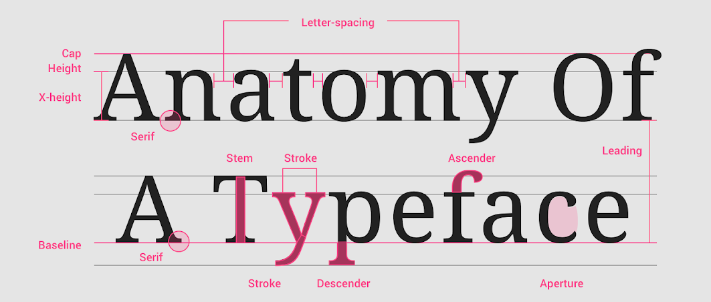
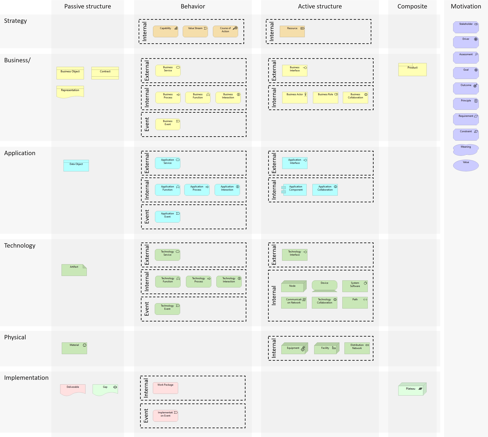

+++
title       = "Typography"
authors     = [ "Emmanuel" ]
date        = "2022-04-05"
draft       = false
description = "Show all typography styles for a post"
tags        = ["bootstrap", "gohugo", "typography" ]
images      = [ "images/typo_logo.png" ]
toc         = false

[[resources]]
  src   = "images/parc-zoologique-11.jpg"
  title = "Un perroquet presque apprivoisé"
  [resources.params]
    exif = true

[[resources]]
  src   = "attachments/matrice_eisenhower.xlsx"
  title = "Matrice d'Eisenhower sous Excel"

[[resources]]
  src   = "attachments/RACI_template.xlsx"
  title = "Un exemple de matrice RACI"

[[resources]]
    src   = "gallery1/20080928_pont_wilson_nuit_007.jpg"
    title = "Autour du Pont Wilson 1/6"

[[resources]]
    src   = "gallery1/20080928_pont_wilson_nuit_010.jpg"
    title = "Autour du Pont Wilson 2/6"

[[resources]]
    src   = "gallery1/20080928_pont_wilson_nuit_011.jpg"
    title = "Autour du Pont Wilson 3/6"

[[resources]]
    src   = "gallery1/20080928_pont_wilson_nuit_013.jpg"
    title = "Autour du Pont Wilson 4/6"

[[resources]]
    src   = "gallery1/20080928_pont_wilson_nuit_016.jpg"
    title = "Autour du Pont Wilson 5/6"

[[resources]]
    src   = "gallery1/20080928_pont_wilson_nuit_017.jpg"
    title = "Autour du Pont Wilson 6/6"

[[resources]]
    src   = "gallery1/20091017_loire_010.jpg"
    title = "Sortie nocturne 1/2"

[[resources]]
    src   = "gallery1/20091017_loire_011.jpg"
    title = "Sortie nocturne 2/2"
+++
Lorem ipsum dolor sit amet, consectetur adipiscing elit, sed do eiusmod tempor incididunt ut labore et dolore magna aliqua. Ut enim ad minim veniam, quis nostrud exercitation ullamco laboris nisi ut aliquip ex ea commodo consequat. Duis aute irure dolor in reprehenderit in voluptate velit esse cillum dolore eu fugiat nulla pariatur. [Excepteur sint occaecat](# "Title of the link") cupidatat non proident, sunt in culpa qui officia deserunt mollit anim id est laborum.
<!--more-->

## The colors

<div class="palette row row-cols-2 row-cols-md-5">
    <div class="col" style="background-color: #252422ff; color: #ddd">#252422ff</div>
    <div class="col" style="background-color: #403d39ff; color: #ddd">#403d39ff</div>
    <div class="col" style="background-color: #eb5e28ff; color: #ddd">#eb5e28ff</div>
    <div class="col" style="background-color: #ccc5b9ff; color: #666">#ccc5b9ff</div>
    <div class="col" style="background-color: #fffcf2ff; color: #666">#fffcf2ff</div>
</div>


## Text with links

Lorem ipsum dolor sit amet, [consectetur adipiscing elit](# "Title of the link"), sed do eiusmod tempor incididunt ut labore et dolore magna aliqua. Ut enim ad minim veniam, quis nostrud exercitation ullamco laboris nisi ut aliquip ex ea commodo consequat. Duis aute irure dolor in reprehenderit in voluptate velit esse cillum dolore eu fugiat nulla pariatur. Excepteur sint occaecat cupidatat non proident, sunt in culpa qui officia deserunt mollit anim id est laborum.

## Headings 

All HTML headings, `<h2>` through `<h6>`, are available. `<h1>` is allocated to the page title.

## h2. Bootstrap heading
### h3. Bootstrap heading
#### h4. Bootstrap heading
##### h5. Bootstrap heading
###### h6. Bootstrap heading


## Inline text

Styling for common inline HTML5 elements.

<p>You can use the mark tag to <mark>highlight</mark> text.</p>
<p><del>This line of text is meant to be treated as deleted text.</del></p>
<p><s>This line of text is meant to be treated as no longer accurate.</s></p>
<p><ins>This line of text is meant to be treated as an addition to the document.</ins></p>
<p><u>This line of text will render as underlined.</u></p>
<p><small>This line of text is meant to be treated as fine print.</small></p>
<p><strong>This line rendered as bold text.</strong></p>
<p><em>This line rendered as italicized text.</em></p>

To switch directories, type <kbd>cd</kbd> followed by the name of the directory.<br>
To edit settings, press <kbd><kbd>ctrl</kbd> + <kbd>,</kbd></kbd>


## Abbreviations

Stylized implementation of HTML’s `<abbr>` element for abbreviations and acronyms to show the expanded version on hover. Abbreviations have a default underline and gain a help cursor to provide additional context on hover and to users of assistive technologies.

<p><abbr title="attribute">attr</abbr></p>
<p><abbr title="HyperText Markup Language" class="initialism">HTML</abbr></p>


## Blockquote

> Lorem ipsum dolor sit amet, consectetur adipiscing elit, sed do eiusmod tempor incididunt ut labore et dolore magna aliqua.

> Lorem ipsum dolor sit amet, consectetur adipiscing elit, sed do eiusmod tempor incididunt ut labore et dolore magna aliqua.
{.info}

> Lorem ipsum dolor sit amet, consectetur adipiscing elit, sed do eiusmod tempor incididunt ut labore et dolore magna aliqua.
{.warning}

> Lorem ipsum dolor sit amet, consectetur adipiscing elit, sed do eiusmod tempor incididunt ut labore et dolore magna aliqua.
{.error}


## List

* Lorem ipsum dolor sit amet, 
* consectetur adipiscing elit, 
* sed do eiusmod tempor incididunt ut labore 
* et dolore magna aliqua.

1. Lorem ipsum dolor sit amet, 
1. consectetur adipiscing elit, 
1. sed do eiusmod tempor incididunt ut labore 
1. et dolore magna aliqua.

1. Lorem ipsum dolor sit amet,
    * Lorem ipsum dolor sit amet, 
    * consectetur adipiscing elit,  
1. consectetur adipiscing elit, 
1. sed do eiusmod tempor incididunt ut labore 
    1. consectetur adipiscing elit, 
    1. sed do eiusmod tempor incididunt ut labore 
1. et dolore magna aliqua.


## Tables

| Eléments        | Classification          | Définition   |
|-----------------|-------------------------|--------------|
| Structuraux     | Actifs (format général) | An internal active structure element represents an entity that is capable of performing behavior |
| Structuraux     | Actifs externes         | An external active structure element, called an interface, represents a point of access where one or more services are provided to the environment |
| Structuraux     | Passifs                 | A passive structure element represents an element on which behavior is performed |
| Comportementaux | Internes                | An internal behavior element represents a unit of activity that can be performed by one or more active structure elements | 
| Comportementaux | Externes                | An external behavior element, called a service, represents an explicitly defined exposed behavior
| Comportementaux | Evènement               | An event represents a state change |


## Images







## Code

Single line code
`import requests`

Piece of code
```python
import requests
import re
 
while True:
    url = input("Enter the URL: ")
 
    if url == "":
        print("Invalid URL")
        continue
    break
 
html = requests.get(url).text
 
links = re.findall('"(https?://.*?)"', html)
 
for link in links:
    print(link)
```

For indicating variables use the <var> tag.
<var>y</var> = <var>m</var><var>x</var> + <var>b</var>


## Attached files



## Images gallery


